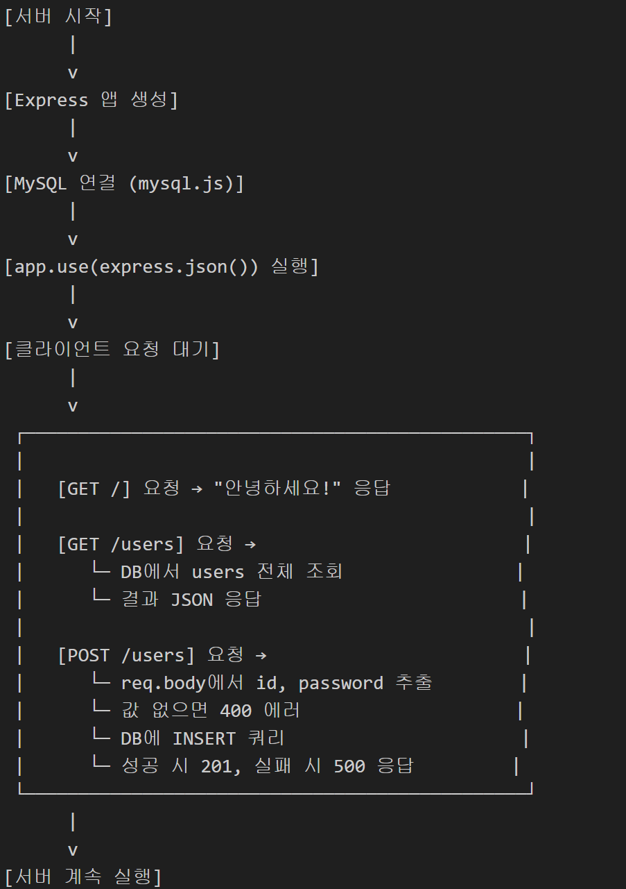
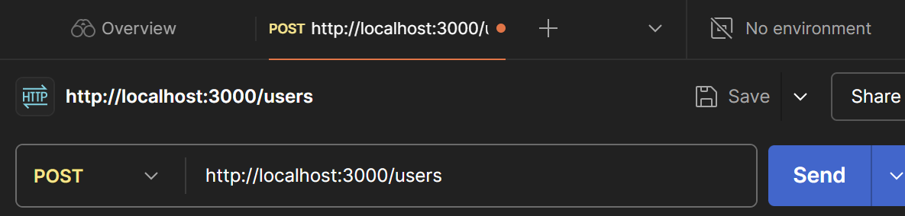
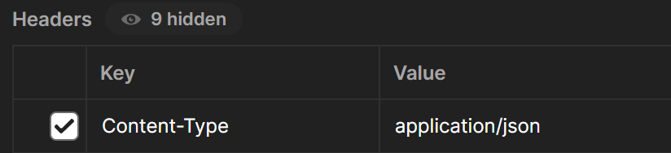
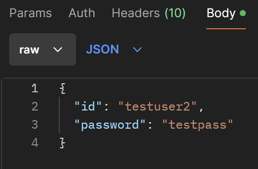
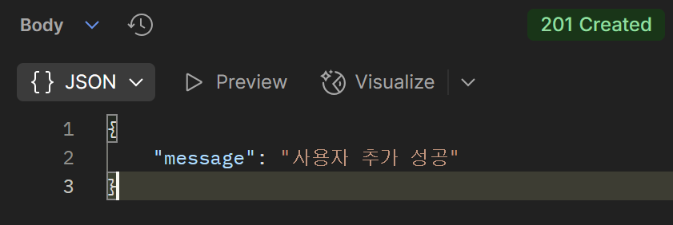
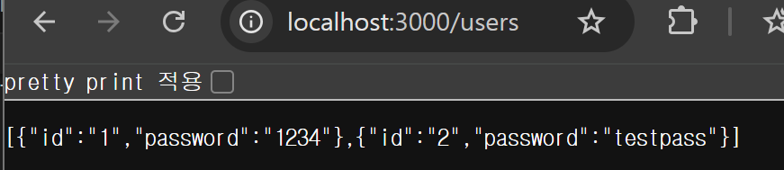
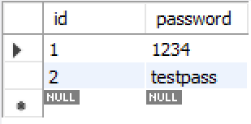

코드설명------------------------------------------------------------------------

!!!!!http://localhost:3000/db 말고 http://localhost:3000/users 로 접속해야됨

#app.use(express.json())
Express 서버에서 클라이언트가 보낸 JSON 형식의 요청 본문(body)을 자동으로 파싱해주는 미들웨어

postman-------------------------------------------------------------------------

포스트맨에서 post를 만들고
http://localhost:3000/users 입력

헤더 타입을 Json으로 설정

body에 DB Json파일에 입력할 값 넣기

send버튼 클릭

상태 확인

결과 확인

mysql---------------------------------------------------------------------------

Primary Key란?
한 테이블에서 각 행(row)을 고유하게 식별해주는 열(column) 을 말함
즉, 중복되면 안 되고, 비어 있어도 안됨됨

id는 모두 고유(unique) 해야 함

같은 id를 두 번 넣으면 에러 발생

id에 NULL(빈 값) 도 못 넣음

중요한 이유
데이터에서 각 사용자(또는 항목)를 구분해야 할 때 필요

데이터 무결성을 지키고, 빠른 검색과 연산이 가능

예: 회원 가입 시 같은 ID로 중복 가입 안 되게 막음

내 서버에 접속하기------------------------------------------------------------
내 컴퓨터에서 3000 방화벽 끄기
다른 컴퓨터에서 http://내아이피:3000 으로 접속(같은 서브넷에서만 가능)
